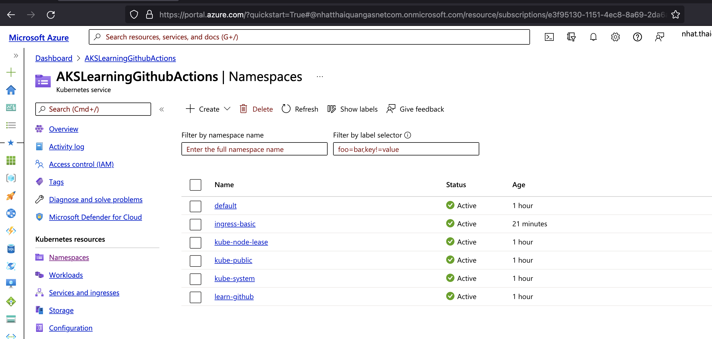
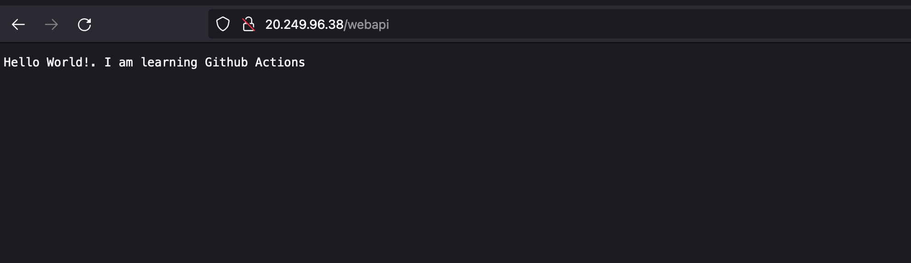

# NET6.WebAPI
.NET6 WebAPI sample using Github Actions for deployments to Azure Kubernetes Service

### Github Runner Requirements 
+ Install Docker & DockerCompose
+ Minikube or Kubernetes cluster (see below if needed)
+ Install azure cli
+ Install Kubectl

### Usage
#### Setup Azure
-----------------
+ Azure Login
    ```
    az login
    ```

+ Create group in Azure
    ```
    az group create --name LearningDeployment --location KoreaCentral
    ```

+ Create AKS Cluster
    ```
    az aks create --resource-group LearningDeployment --name AKSLearningGithubActions --node-count 2 --generate-ssh-keys
    ```

+ Get Credentials for kubectl
    ```
    az aks get-credentials -n AKSLearningGithubActions -g LearningDeployment
    ```

+ Create ACR
    ```
    az acr create --resource-group LearningDeployment --name learndeploymentgithub --sku Basic
    ```

+ Login ACR(Required: docker start on your machine)
    ```
    az acr login --name learndeploymentgithub
    ```

+ Create AZURE_CREDENTIALS
    ```
    az ad sp create-for-rbac --name "net6web" --role contributor --scopes /subscriptions/<SUBSCRIPTION_ID>/resourceGroups/<RESOURCE_GROUP> --sdk-auth
    ```
    Copy and paste into secret AZURE_CREDENTTIAL in the github repository 


+ [Create container registry Credentials](https://docs.microsoft.com/en-us/azure/container-registry/container-registry-auth-service-principal)
    ```
    #!/bin/bash
    # This script requires Azure CLI version 2.25.0 or later. Check version with `az --version`.

    # Modify for your environment.
    # ACR_NAME: The name of your Azure Container Registry
    # SERVICE_PRINCIPAL_NAME: Must be unique within your AD tenant
    ACR_NAME=learndeploymentgithub
    SERVICE_PRINCIPAL_NAME=PrincipalLearnDeploymentGithubActions

    # Obtain the full registry ID
    ACR_REGISTRY_ID=$(az acr show --name $ACR_NAME --query "id" --output tsv)
    # echo $registryId

    # Create the service principal with rights scoped to the registry.
    # Default permissions are for docker pull access. Modify the '--role'
    # argument value as desired:
    # acrpull:     pull only
    # acrpush:     push and pull
    # owner:       push, pull, and assign roles
    PASSWORD=$(az ad sp create-for-rbac --name $SERVICE_PRINCIPAL_NAME --scopes $ACR_REGISTRY_ID --role acrpush --query "password" --output tsv)
    USER_NAME=$(az ad sp list --display-name $SERVICE_PRINCIPAL_NAME --query "[].appId" --output tsv)

    # Output the service principal's credentials; use these in your services and
    # applications to authenticate to the container registry.
    echo "Service principal ID: $USER_NAME"
    echo "Service principal password: $PASSWORD"
    ```

+ Run Github Action deploy_aks

### Create Ingress and expose IP
---------------------------------
+ Create Static IP
    ```
    az aks show --resource-group LearningDeployment --name AKSLearningGithubActions --query nodeResourceGroup -o tsv
    ``` 
    --> MC_LearningDeployment_AKSLearningGithubActions_koreacentral


    ```
    az network public-ip create --resource-group MC_LearningDeployment_AKSLearningGithubActions_koreacentral --name AKSLearningGithubActions --sku Standard --allocation-method static --query publicIp.ipAddress -o tsv
    ```
    --> 20.249.96.38(IP Address)

+ Create namespace for ingress 
    ```
    kubectl create namespace ingress-basic
    ```

+ Add ingress-nginx repo from helm command
    ```
    helm repo add ingress-nginx https://kubernetes.github.io/ingress-nginx
    helm repo add stable https://kubernetes-charts.storage.googleapis.com/
    helm repo update
    ```

+ Set Ingress with IP(expose IP)
    ```
    helm install ingress-nginx ingress-nginx/ingress-nginx --namespace ingress-basic --set controller.replicaCount=2 --set controller.nodeSelector."beta\.kubernetes\.io/os"=linux --set defaultBackend.nodeSelector."beta\.kubernetes\.io/os"=linux --set controller.service.externalTrafficPolicy=Local --set controller.service.loadBalancerIP="20.249.96.38"
    ```

+ Check service
    ```
    kubectl get service -l app.kubernetes.io/name=ingress-nginx --namespace ingress-basic
    ```
    Results:
    ```
    ingress-nginx-controller             LoadBalancer   10.0.42.164   20.249.96.38   80:31350/TCP,443:30212/TCP   68s
    ingress-nginx-controller-admission   ClusterIP      10.0.69.59    <none>         443/TCP                      68s   
    ```

+ Get external IP
    ```
    kubectl get all -n ingress-basic
    ```
    --> Go to browser and enter IP(http://20.249.96.38/). It should be showed nginx(404 NOT FOUND)

+ Check the Web APP
    ```
    http://20.249.96.38/webapi
    ```

### Result
+ 
+ 

### References
+ [Install Azure CLI](https://docs.microsoft.com/en-us/cli/azure/install-azure-cli-macos)
+ [AKS Github Actions](https://docs.microsoft.com/en-us/azure/aks/kubernetes-action?tabs=userlevel)
+ [KubeLab Github Actions](https://azure.github.io/kube-labs/1-github-actions.html#_1-create-a-deployment-pipeline)
+ [AKS deployment with github actions](https://docs.microsoft.com/en-us/learn/modules/aks-deployment-pipeline-github-actions/)